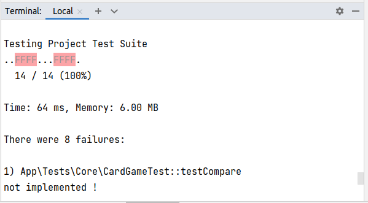

= Guess What

Prise en main de la POO avec PHP

Niveau : Première ou deuxième année de BTS SIO SLAM

Prérequis : bases de la programmation, PHP 8 ou supérieur installé sur votre machine de dev.

== Thème 

Développer une logique de jeu en PHP en mettant en oeuvre de la conception objet et des tests unitaires.

Jeu en mode console. Un début d'implémentation est proposé (`play-console.php` à lancer dans une console)

TIP:  Ce projet est un bon candidat à une application web avec Laravel, éligible comme activité professionnelle si prise en compte des scores des joueurs dans une base de données.

== Objectif

* Conception et mise au point d'une logique applicative avec PHP Objet et PHPUnit

* Structure de données, recherche d'un élément dans une liste

* Analyse des actions du joueur (fonction du nombre de cartes, aides à la décision)

== Les étapes d'un scénario typique d'usage sont

1. (optionnel pour le joueur) paramétrage du jeu (par exemple choix du jeu de cartes, activation de l'aide à la recherche, ...)
2. Lancement d'une partie (le jeu instancie un jeu de carte et tire une carte "au hasard"), que le joueur doit deviner en un *temps optimal*
3. Le joueur propose une carte
4. Si ce n'est pas la bonne carte, alors si l'aide est activée, le joeur est informé si la carte qu'il a soumise est plus petite ou plus grande que celle à deviner. Retour en 3.  Si c'est la bonne carte alors la partie se termine (passe à l'étape suivante)
5. Le jeu affiche des éléments d'analyse (nombre de fois où le joueur a soumis une carte, sa *qualité stratégique*, ...)
6. Fin de la partie.

== Premiers éléments d'analyse

[plantuml]
----
class Game {
  withHelp : boolean

  start()
  isMatch(c : Card) : boolean
  getStatistic() : string
}

class CardGame {
  name
  {static} compare(Card c1, Card c2) : int
}

class Card {
  name
  color
}

Game"*" -> "\ncardToGuess  1  " Card : "                             "
Game"*" -> "cardGame 1  " CardGame : "                                     "
CardGame "*" --> "   * cards  " Card : "                                     "
hide circle
----

Cette analyse est une première ébauche, donc incomplète et à ajuster, mais suffisante pour réaliser vos premiers pas sur ce projet. Qu'est-ce qu'elle nous dit ?

* Une instance de `Game` est liée à une instance de `CardGame` (un jeu de cartes) nommée `cardGame` et à une instance de `Card` nommée `cardToGuess` (la carte à deviner)
* Une instance de `CardGame` est liée à une collection de cartes (`array` of instances of `Card`) nommées `cards`.

Pour l'essentiel (le cours associé apportera d'autres informations et répondra à vos questions) :

* La classe `Game` est responsable de la logique du jeu.
* La classe `CardGame` définit la structure d'un jeu de cartes classique (de type jeu de 32 ou 54 cartes) et ses méthodes.
* La classe `Card` définit la structure d'une carte à jouer et ses méthodes.

En résumé : Une instance de `Game` est reliée, à un instant _t_, à un jeu de cartes, lui-même reliè à un ensemble de cartes  (`cards`), et à une instance de `Card` (`cardToGuess` est la carte que le joueur doit deviner)

== Première implémentation

Classe `Card` (extrait. Localisation : `src/Core/Card.php`)

[, php]
----
<?php
namespace App\Core;

/**
 * Class Card : Définition d'une carte à jouer
 * @package App\Core
 */
class Card
{
  /**
   * @var $name string nom de la carte, comme par exemples 'As' '2' 'Reine'
   */
  private $name;

  /**
   * @var $color string couleur de la carte, par exemples 'Pique', 'Carreau'
   */
  private $color; 

  /**
   * @return string
   */
  public function getName(): string
  {
    return $this->name;
  }

  // [...]
}
----

Classe `Game` (incomplète. Localisation : `src/Core/Game.php`)

[, php]
----
<?php

namespace App\Core;

/**
 * Class Game : la logique du jeu.
 * @package App\Core
 */
class Game
{
  /**
   * @var CardGame un jeu de cartes
   */
  private $cardGame;

  /**
   * @var Card c'est la carte à deviner par le joueur
   */
  private $cardToGuess;

  /**
   * @var bool pour prendre en compte lors d'une partie
   */
  private $withHelp;
}
----

NOTE: L'usage de la syntaxe de documentation PHPDoc https://docs.phpdoc.org/3.0/guide/getting-started/what-is-a-docblock.html[DocBloc] est attendue dans votre code !

== Challenge-1 : Prise en main et tests unitaires (4h à 10h)

=== Vérifier les prérequis de votre système

* `php cli`  doit être opérationnel. (en ligne de commande tester : `php -version`)
* `composer` doit être opérationnel. (en ligne de commande tester : `composer -V`)

=== Télécharger le projet de démarrage

TIP: Conseil : utiliser l'instruction `git clone` ou encore mieux, si vous êtes connecté à GiltLab avec votre compte, faire directement, en ligne, un `fork` de ce projet ; vous pourrez ainsi directement cloner, sur votre machine de dev, votre nouveau projet (et réaliser des `commit` et `push` de votre travail).

Une fois cloné, **aller à la racine du projet** puis lancer les commandes suivantes :

* `composer install`  (le téléchargement et installation des composants déclarés dans le fichier `composer.json` peut prendre quelques minutes)

* `composer update`  (actualisation des dépendances)

* `.\vendor\bin\phpunit --version` (le premier lancement de cette commande provoquera l'installation du plugin `phpunit`, puis lancera les tests.
  Le résultat devrait être, à un numéro de version prêt : `PHPUnit 10.5.9 by Sebastian Bergmann and contributors.` )

TIP: Sous windows la commande est `php .\vendor\bin\phpunit --version` (remarquez l'usage de `\` au lieu de `/` )

=== Tester le bon fonctionnement de ce petit existant

==== Lancement des tests unitaires
  
À **la racine du projet** du projet, lancer la commande : `./bin/phpunit tests`
(Sous Windows: .\vendor\bin\phpunit tests)

Le système lance alors l'exécution des tests unitaires du dossier `tests` du projet. 14 tests sont exécutés (100 % sans bug), dont 8 en échec (`FAILURE`) :

----
[racine du projet]$ ./bin/phpunit

Testing Project Test Suite
..FFFF...FFFF.                   14 / 14 (100%)

Time: 60 ms, Memory: 6.00 MB

There were 8 failures:

[. . .]

FAILURES!
Tests: 14, Assertions: 17, Failures: 8.

----

Cette commande a lancé 14 tests unitaires (14 méthodes de test avec 17 assertions) situés dans le dossier `tests`. Les tests vérifient le comportement de certains objets du projet (instances des classes `CardTest`, `CardGameTest` et `GameTest`)

Avant d'aller plus loin, vous devez étudier le concept de _test unitaire_ et prendre connaissance des bonnes pratiques de documentation du code.

Ressources à étudier (compter ~6h) :

* https://openclassrooms.com/fr/courses/4087056-testez-unitairement-votre-application-php-symfony/7828665-faites-vos-premiers-pas-avec-phpunit-et-les-tests-unitaires[Sur openclassrooms : premiers-pas-avec-phpunit-et-les-tests-unitaires] ou encore en anglais sur Laracast https://laracasts.com/series/php-testing-jargon **à étudier - chez vous et/ou lors des séances de TP** - n'hésitez pas à noter vos questions, nous y répondrons en cours.
* https://docs.phpunit.de/en/11.0/[Documentation de PHPUnit en anglais]

TIP: **TODO PROF** : première évaluation sur la capacité de l'étudiant à étudier : questions autour du code présenté et premiers concepts gravitant autour des tests unitaires.

== Challenge-2 : Implémentation des TODOs de `CardTest` (~2H)

Bravo, si vous en êtes là, c'est que :

* Votre machine de dev est opérationnelle pour ce projet.
* Les concepts autour des test unitaires ne vous sont pas étranger.
* Que vous avez investi au minimum 6h de votre temps au concept de test unitaire.

Vous allez maintenant avoir besoin d'un éditeur de code source qui vous permette de passer en mode projet.

TIP: une *erreur de débutant* consiste à ouvrir un fichier à la fois à partir de son éditeur de code (IDE) au lieu d'ouvrir le dossier du projet.
 
Nous vous invitons à utiliser **PHPStorm** (un IDE très puissant en terme de conseils et de génération automatique de code).
 
Ouvrir le projet via `File | Open`, puis sélectionner le **dossier racine** de votre application.

Dans la fenêtre `Termnal` en bas, vous devriez pouvoir lancer la commande `.\vendor\bin\phpunit tests` et obtenir ceci :

Le message `There were 8 failures` nous informe que 8 tests ont échoués.
**Ceci est votre premier challenge !**

Voici un extrait de la classe de test CardTest:

[, php]
----
<?php

namespace App\Tests\Core; <1>

use PHPUnit\Framework\TestCase;
use App\Core\Card;

class CardTest extends TestCase <2>
{

  public function testName() <3>
  {
    $card = new Card('As', 'Trèfle');  <4>
    $this->assertEquals('As', $card->getName()); <5>
  }

----
<1> Les classes de test sont placées, par convention, sur une arborescence `tests` (ou `test`) parallèle à `src`
<2> Cette classe de test hérite de `TestCase` (du framework `PHPUnit`)
<3> Attention, les méthodes de test commencent par le préfix _test_
<4> Création d'une instance de `Card` (As de trèfle)
<5> C'est ici que le test a lieu. `$this->assertEquals` (méthode héritée) permet de comparer une *valeur attendue* (premier argument) avec une *valeur obtenue* par l'appel à la méthode `getName` de l'instance précédemment créée (second argument). Le résultat présenté suite à l'appel de `$this->assertEquals` est géré par `PHPUnit`
qui en fait l'analyse et la restitue en fin d'exécution des tests (exécution provoquée par la commande `./bin/phpunit` dans le terminal)

Dans les classes de package `Core`, le travail à faire a été signalé dans le code source par des commentaires `TODO` (une pratique courante dans le métier).

 
WARNING: Attention : la méthode toString fait partie des méthodes dites "_magiques_" en PHP (commence par *deux* _underscores_). À ce sujet vous consulterez cette documentation https://www.php.net/manual/fr/language.oop5.magic.php#object.tostring[methode "magique" toString]

[TIP]
====
Pour n'exécuter qu'*une seule méthode de test*, d'une classe de test donnée, utiliser le paramètre _filter_ en argument de _phpunit_. Exemple (dans la console, à la racine de l'application) : +
`.\vendor\bin\phpunit tests/Core/CardTest.php --filter testCompareSameCard`

`Testing App\Tests\Core\CardTest 1/1 (100%)`

`Time: 47 ms, Memory: 6.00 MB`

`OK (1 test, 1 assertion)`
====

TIP: Comment consulter l'état d'une variable (simple debug) lors de la mise au point d'un test unitaire avec PHPUnit ? voir : https://stackoverflow.com/questions/8070354/phpunit-dumping-variables

== Challenge-3 : Conception de tests unitaires pour `CardGame`
=== Travaux pratiques

1 . Dans le terminal du projet, lancer la commande `./bin/phpunit  tests/Core/CardTest.php`.
(Sous Windows: `.\vendor\bin\phpunit tests/Core/CardTest.php`)
Le résultat devrait être celui-ci :

[source]
----
FAILURES!
Tests: 7, Assertions: 9, Failures: 4.
----

2 . Corriger et ou implémenter les texts unitaire en échec, et *faites évoluer la classe `Card` en conséquence*, car celle-ci n'est implémentée que partiellement.

L'objectif est double : mettre au point des tests unitaires et améliorer la logique métier des classes du package `Core`.

À ce niveau là, vous avez acquis une certaine autonomie sur le projet et intégré les concepts de base de la notion de tests unitaires. C'est ce que nous allons vérifier.

=== Travail à faire

* Poursuivez la conception des méthodes de test qui testent le bon comportement des objets (méthodes d'instance) de la classe classe `CardGame`, ainsi que ses méthodes statiques (méthodes de classe)

* Poursuivez la conception de la classe `CardGame` : les TODO et au delà.

* Proposez une méthode de construction (_factory_) pour un jeu de 54 cartes, avec un test unitaire qui lui est dédié.

TIP: Pour consulter la liste des TODOs, ouvrir la fenêtre TODO tool: `View | Tool Windows | TODO`

== Challenge-4 : Conception de tests unitaires pour `Game` (~4h à 8h)
=======

Votre mission consiste à concevoir une classe de tests qui teste la logique du jeu (représentée par la classe `Game`).

Ce travail est à réaliser en binôme. Il y aura également des décisions à prendre, qui pourront être discutées collectivement, entre différents binômes.

Voici quelques éléments à prendre en compte dans votre analyse.

* *Recherche linéaire* (dite aussi séquentielle) : L'utilisateur explore une à une les cartes afin de trouver la bonne.
Dans le pire cas il soumettra autant de cartes que le jeu en contient (l'ordre de grandeur est O(n), _n_ étant 
le nombre de cartes), dans le meilleur cas O(1) (coup de chance il tombe dessus du premier coup).  
* *Recherche dichotomique* (nécessite une relation d'ordre total) : Si l'utilisateur est informé de la position de
la carte qu'il soumet par rapport à la carte à trouver (inférieur ou supérieur) alors il peut appliquer une 
stratégie qui réduit le nombre de cas à soumettre dans le pire cas, de l'ordre de O(log2 n). Wikipédia vous fournira
des informations utiles sur ces notions.

L'analyse de la stratégie du joueur, lorsqu'il termine une partie, devra prendre en compte les paramètres de la partie, à savoir le nombre de cartes et l'aide à la décision si elle a été activée pour la partie en question.

L'analyse de la stratégie du joueur peut être représentée sous la forme d'un texte (une chaine de caractères). C'est à vous de décider de son contenu (sa valeur).
=======
== Travail à faire

1 . Poursuivre l'implémentation du script `play-console.php`, présent dans le packe `Core`.

TIP: Vous pouvez jouer et tester vos modifications en lancant ce scriptpar la commande `php play-console.php` (à partir du dossier `src/Core`)

2 . En parallèle, poursuivre la conception de la classe de test `GameTest` et de la classe `Game`.

== Livraison

Modalité de livraison (mode « binôme ») :

* Dépôt de votre projet sur GitLab avec un *README.adoc* ou Github avec un *README.md*. Ce document présentera le travail que vous avez réalisé (Challenge 1 à 4), ce sera votre *rapport de projet*. Il inclura un lien vers le dépôt initial _guesswhat_ (celui-ci) et un vers votre propre dépôt.

* Livraison par mail d'une version *pdf* de votre README au plus tard *_le vendredi 5 avril au soir_*.

Ressources utiles :

* Gitlab et AsciiDoc: https://docs.gitlab.com/ee/user/asciidoc.html[courte documentation asciidoc sur GitLab]
* Github et MarkDown https://guides.github.com/features/mastering-markdown/

TIP: sous PhpStorm, vous pouvez extraire une version *PDF* de votre REAMDE.adoc (fonction dans la barre de menu d'édition du .adoc).

TIP: Pour le travail en binôme ou trinome, sous PhpStorm, voir le concept (et outil)  _code with me_

NOTE: n'hésitez pas à consulter le code source de ce README.adoc et sa version .md.

Bonne analyse et programmation !
